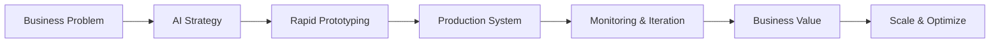

# 👋 Hi, I'm Saurabh Bhardwaj

<div align="center">
  
### 🤖 AI Architect | Agentic AI Specialist | MLOps Engineer

[](https://www.linkedin.com/in/saurabhbhardwajofficial/)
[](https://twitter.com/saurabh_bhar)
[](mailto:aryan.saurabhbhardwaj@gmail.com)

</div>

---

## 🎯 What I Do

I transform business challenges into **production-ready AI solutions**. With **19+ years of engineering experience** (12 in automotive, 7+ in AI/ML), I architect **enterprise-grade Generative AI systems** that deliver measurable ROI—not just proofs of concept.

```python
class SaurabhBhardwaj:
    def __init__(self):
        self.role = "Lead AI Architect @ Delaware"
        self.location = "Milton Keynes, UK"
        self.expertise = ["Agentic AI", "RAG Systems", "MLOps", "LangGraph"]
        self.mission = "Building AI agents that work in production, not just demos"
    
    def current_focus(self):
        return [
            "🤖 Building production-grade AI agents with LangGraph",
            "🔧 Developing MCP servers for seamless tool integration",
            "📱 Creating MenuLens: AI-powered allergen detection app",
            "📚 Teaching others to transition into AI careers"
        ]
```

---

## 🚀 Featured Projects

<table>
<tr>
<td width="33%">

### 🍽️ [MenuLens](https://github.com/Bhardwaj-Saurabh/menulens)
AI-powered allergen detection from menu photos

**Tech**: FastAPI, React Native, Azure OpenAI, CV  
**Impact**: Safe dining for allergy sufferers

[→ View Project](https://github.com/Bhardwaj-Saurabh/menulens)

</td>
<td width="33%">

### 🧠 [Gmail MCP Server](https://github.com/Bhardwaj-Saurabh/gmail-mcp-server)
Model Context Protocol for Claude Desktop

**Tech**: Python, MCP, OAuth 2.0, Gmail API  
**Impact**: Seamless email automation

[→ View Project](https://github.com/Bhardwaj-Saurabh/gmail-mcp-server)

</td>
<td width="33%">

### 🏡 [EcoHome AI](https://github.com/Bhardwaj-Saurabh/ecohome-ai)
Energy optimization assistant agent

**Tech**: LangGraph, Azure OpenAI, FastAPI  
**Impact**: Agentic orchestration demo

[→ View Project](https://github.com/Bhardwaj-Saurabh/ecohome-ai)

</td>
</tr>

<tr>
<td width="33%">

### 🦠 [Malware Detection](https://github.com/Bhardwaj-Saurabh/Microsoft_malware_detection)
End-to-end ML for malware classification

**Tech**: Python, Scikit-learn, XGBoost, Flask  
**Impact**: Microsoft dataset analysis

[→ View Project](https://github.com/Bhardwaj-Saurabh/Microsoft_malware_detection)

</td>
<td width="33%">

### ⚙️ [Sensor Fault Detection](https://github.com/Bhardwaj-Saurabh/Sensor_Fault_Detection_Scania)
Predictive maintenance for heavy vehicles

**Tech**: Python, ML Pipelines, Docker  
**Impact**: Scania trucks fault prediction

[→ View Project](https://github.com/Bhardwaj-Saurabh/Sensor_Fault_Detection_Scania)

</td>
<td width="33%">

### 💳 [Credit Card Defaulters](https://github.com/Bhardwaj-Saurabh/identify-credit-card-defaulters)
Risk assessment ML application

**Tech**: Python, Classification Models, Flask  
**Impact**: Financial risk prediction

[→ View Project](https://github.com/Bhardwaj-Saurabh/identify-credit-card-defaulters)

</td>
</tr>

<tr>
<td width="33%">

### 📊 [A/B Test Analysis](https://github.com/Bhardwaj-Saurabh/Analyze_A-B_Test_Results)
Statistical analysis for conversion optimization

**Tech**: Python, Statistics, Hypothesis Testing  
**Impact**: Data-driven decisions

[→ View Project](https://github.com/Bhardwaj-Saurabh/Analyze_A-B_Test_Results)

</td>
<td width="33%">

### 🐾 [Animal Adoption Predictor](https://github.com/Bhardwaj-Saurabh/Animal-Adoption-Likelihood-Estimation)
Predict adoption likelihood for shelters

**Tech**: Python, ML Classification, EDA  
**Impact**: Shelter optimization

[→ View Project](https://github.com/Bhardwaj-Saurabh/Animal-Adoption-Likelihood-Estimation)

</td>
<td width="33%">

### 🚨 [Disaster Response](https://github.com/Bhardwaj-Saurabh/Project-Disaster-Response-pipeline)
NLP pipeline for emergency classification

**Tech**: Python, NLP, Flask, SQLite  
**Impact**: Real-time disaster response

[→ View Project](https://github.com/Bhardwaj-Saurabh/Project-Disaster-Response-pipeline)

</td>
</tr>
</table>

<div align="center">

**[→ View All 81 Projects](https://github.com/Bhardwaj-Saurabh?tab=repositories)**

</div>

---

## 💼 Services I Offer

<table>
<tr>
<td width="50%">

### 🎯 For Startups

- **Rapid AI MVP Development**
  - Get from idea to working prototype in 2-4 weeks
  - Focus on product-market fit, not over-engineering
  
- **AI Strategy Consulting**
  - Identify high-ROI AI opportunities
  - Technology stack recommendations
  - Build vs. buy decisions

- **Fractional AI Leadership**
  - Part-time CTO/Head of AI
  - Build your AI team and processes
  - Hands-on architecture and code reviews

</td>
<td width="50%">

### 🏢 For Enterprises

- **RAG System Architecture**
  - Production-grade retrieval systems
  - Multi-modal AI pipelines
  - Knowledge management at scale

- **AI Agent Development**
  - LangGraph orchestration
  - Tool integration (MCP, APIs)
  - Evaluation frameworks

- **MLOps Implementation**
  - Azure/AWS deployment pipelines
  - Monitoring & observability
  - Model governance & compliance

</td>
</tr>
</table>

---

## 🛠️ Technology Stack

<div align="center">

### AI & Machine Learning


### Cloud & DevOps


### AI Orchestration & Agents


### Data & MLOps


</div>

---

## 📊 My Approach



**Philosophy**: Ship working solutions fast, then iterate. Focus on the 20% of features that deliver 80% of the value.

---

## 🎓 Education & Credentials

<table>
<tr>
<td>

**🎓 Academic**
- MSc Applied Artificial Intelligence  
  *Cranfield University, UK*
- Data Science Bootcamp (🥇 1st Rank)  
  *Imperial College London*
- B.Tech Mechanical Engineering  
  *UPTU, India*

</td>
<td>

**📜 Certifications**
- Azure AI Engineer (AI-102)
- Azure Data Scientist (DP-100)
- Microsoft Fabric Engineer (DP-600)
- Generative AI Nanodegree (Udacity)
- MLOps Specialization (Coursera)
- AWS Data Science (Practical)

</td>
</tr>
</table>

---

## 📈 GitHub Stats

<div align="center">


</div>

---

## 💬 What My Clients Say

> *"Saurabh delivered a production-ready RAG system that transformed our knowledge management. His ability to bridge business needs with technical implementation is exceptional."*  
> **— Enterprise Client, UK Financial Services**

> *"Working with Saurabh accelerated our AI roadmap by 6 months. He doesn't just build systems; he builds capabilities within teams."*  
> **— Startup Founder, SaaS Platform**

---

## 📚 Recent Content

I share practical AI insights on LinkedIn:

- 🧠 **Building Production RAG Systems** - Architecture patterns that actually work
- 🤖 **Agent Development with LangGraph** - From prototype to production
- 🔧 **MCP Server Development** - Tool integration for AI agents
- 🎯 **AI Career Transitions** - From engineering to AI (my 12-year automotive journey)

[→ Follow me on LinkedIn for weekly insights](https://www.linkedin.com/in/saurabhbhardwajofficial/)

---

## 🤝 Let's Work Together

<div align="center">

### 📅 Book a Consultation

I'm currently available for:
- 💼 **Consulting Projects** (AI architecture, RAG systems, agent development)
- 🎤 **Speaking & Workshops** (GenAI, MLOps, career transitions)
- 👨‍💼 **Fractional CTO Roles** (startups scaling AI capabilities)
- 🚀 **AI MVP Development** (rapid prototyping to production)

### 📬 Get In Touch

[](mailto:aryan.saurabhbhardwaj@gmail.com)
[](https://www.linkedin.com/in/saurabhbhardwajofficial/)
[](https://calendly.com/yourusername)

**Response Time**: Within 24 hours | **Time Zone**: GMT (London)

</div>

---

<div align="center">

### 💡 *"The future belongs to those who integrate intelligence—not just automate."*


⭐ **If you find my work valuable, consider starring my repositories!**

</div>